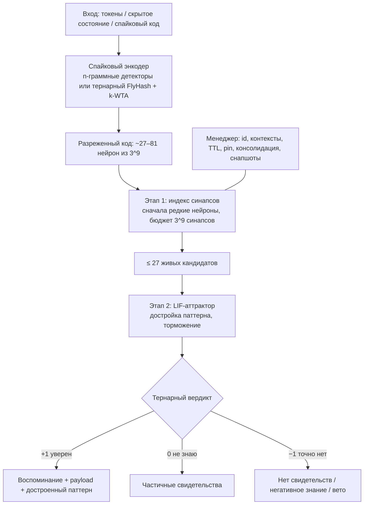

# Архитектура snn-memory

Документ описывает, как концепция ([concept.md](concept.md)) превращена в работающий код и какие решения приняты по ходу. Ссылки вида §N ведут на разделы концепции.

## 1. Общая схема

SNN отвечает за динамику, ассоциации, достройку и конкуренцию. Менеджер отвечает за адресацию, жизненный цикл и точное удаление (§2, §10).

## 2. Тернарное представление

| Уровень | Представление | Размер |
|---|---|---|
| Трит | `−1 / 0 / +1` | 1.58 бита информации |
| Трайт | 9 трит, `u16`, 3^9 = 19 683 состояния | 2 байта |
| Нейрон | id = один трайт | пространство 19 683 нейрона |
| Синапс | id пресинаптического нейрона (трайт) + 2 трита состояния (медленный, быстрый) | 2 байта + 3.2 бита |
| Упаковка | `TritVec`: 5 трит в байте (3^5 = 243 ≤ 256), 40 трит в `u64` (3^40 < 2^64) | 1.6 бита/трит |
| Проекция FlyHash | вес `±1` в бите 31 индекса входа, `0` = нет связи | 4 байта на связь |
| K/V (опционально) | absmean-тернаризация (как BitNet b1.58) + масштаб на вектор | 1.6 бита/элемент |

Эффективное состояние синапса: `clamp(slow + fast, −1, 1)`.
- `+1` — возбуждающий: свидетельство «за».
- `0` — молчащий: хранит след, может ожить.
- `−1` — тормозной: свидетельство «против».

Эти же три значения дают три ответа памяти (§9): «уверен», «не знаю», «точно нет».

Все гиперпараметры — степени тройки:

| Параметр | Значение |
|---|---|
| Нейронов | 3^9 |
| Ширина энграммы | 3^4, максимум 3^5 |
| Кандидатов | 3^3 |
| Победителей плотного энкодера | 3^4 |
| Шагов динамики | 3^2 |
| Бюджет сканирования | 3^9 синапсов |
| Чанк / шаг контекста | 27 / 9 токенов |

Пороги заданы в девятых долях: извлечение 2/9, отказ 1/9.

Двоичными остаются только машинные детали: байты, сдвиги упаковки, `u32`-слова индекса.

## 3. Энкодеры (§5.1)

- **`NGramEncoder`** — детекторы временных совпадений для токенов. Детектор n-граммы срабатывает, когда упорядоченная серия из n токенов приходит подряд (линия задержек). Код фрагмента является **подмножеством** кода любой последовательности, где этот фрагмент встречается, поэтому частичное извлечение по фрагменту точное: покрытие = 1. Порядок токенов тоже кодируется.
- **`FlyHashEncoder`** — для плотных векторов (скрытых состояний LLM). Это разреженное расширение с фиксированной тернарной связностью (fan-in 9–27 входов на нейрон) плюс k-winners-take-all, то есть латеральное торможение (Dasgupta et al., 2017). Близкие векторы дают перекрывающиеся коды. Реализация без умножений и ветвлений: вес применяется переворотом знакового бита. k-WTA выполняется потоковой top-k кучей с отсечкой, около 100 мкс на кодирование при d=1024.
- **`CodeEncoder`** — готовые спайковые коды.

## 4. Энграммы и синапсы (§4, §7, §14)

Каждое воспоминание — отдельный энграмм-нейрон со **своими** афферентными синапсами. Это вариант A + C из §14: владение плюс разреженная аллокация. Общих синапсов нет, поэтому `forget(A)` удаляет ровно вклад A и не может повредить B. Проблема shared synapses из §14 снята конструктивно.

- **Банки.** Их два: быстрый (эпизодическая память, §3.2) и долговременный (§3.3). Консолидация переносит энграмму в долговременный банк: эффективное состояние становится медленной компонентой. Последующая пластичность пишется в быструю компоненту и стирается `reset_fast_memory`, как описано в §7.
- **Индекс.** Возбуждающие и тормозные синапсы хранятся в двух индексах «нейрон → (слот, позиция)». Молчащие синапсы не индексируются, поэтому индексный этап никогда не читает состояние синапса.
- **Пластичность** (§6) дискретная, в духе bounded synapses Amit–Fusi:

| Событие | Переход |
|---|---|
| Совместная активность пре- и пост-нейрона | `−1 → 0 → +1` (вероятность `p_potentiate`) |
| Пресинаптический нейрон молчит | `+1 → 0` (вероятность `p_depress`) |
| Новые активные входы | подключаются на свободные или молчащие позиции (синаптогенез и turnover) |

  Одно нетипичное предъявление не переписывает память.
- **Новизна** (§5.2). Если новый вход в том же контексте похож на существующий (`min(покрытие, полнота) ≥ 0.9`), существующая энграмма подкрепляется, а не дублируется. Если у новой записи противоположная полярность, происходит пересмотр убеждения: побеждает новое утверждение.

## 5. Извлечение (§8–§10)

**Этап 1 — индекс.** Нейроны сигнала сортируются по fan-out, и сканирование идёт от редких к частым в пределах бюджета 3^9 синапсов (приём max-score/WAND из поисковых систем).
- Редкие нейроны несут почти всё свидетельство.
- Вклад непросканированных нейронов учитывается как возможное свидетельство, поэтому префильтр и граница «точно нет» остаются корректными.
- Очки копятся в одном массиве-аккумуляторе: один промах кэша на синапс.
- Метаданные (живость, контекст, TTL) читаются только для лучших кандидатов.

**Гомеостаз.** Усиление нейрона равно `ln(1 + M/(fan_out+1))`. Нейроны, участвующие во многих энграммах, весят меньше: это внутренняя пластичность, нейронный аналог IDF.

**Этап 2 — LIF-аттрактор** (`dynamics.rs`):
- Драйв энграммы `j` вычисляется как `x_j = Σ_{i∈A∩E_j} g_i·w_ij / Σ_{i∈A} g_i`: доля активного ансамбля, объяснённая её синапсами (дивизивная нормализация). Тормозные синапсы вычитаются.
- Сработавшая энграмма восстанавливает свой ансамбль. Это достройка паттерна: её драйв растёт к 1, а у конкурентов падает.
- Общий тормозной интернейрон подавляет всех, кто слабее победителя. Почти-дубликаты выживают, слабые частичные совпадения гасятся (§9).
- Порог мембраны откалиброван так, что драйв ровно `recall_threshold` доходит до спайка на последнем шаге.

**Вердикт:**

| Ответ | Основание |
|---|---|
| `+1 Known` | энграмма вошла в аттрактор, сходство ≥ 2/9 |
| `−1 Absent / NegativeKnowledge` | вспомнилось негативное знание (`LearnOptions::negative`) |
| `−1 Absent / NoEvidence` | ни одна живая энграмма не объясняет даже 1/9 сигнала |
| `−1 Absent / Inhibited` | энграмма совпала бы, но её тормозные синапсы налагают вето (`suppress`) |
| `0 Unknown / Partial` | есть частичные свидетельства, аттрактора нет |

**Кратковременное облегчение (STP, §3.1).** Недавно активные энграммы получают прибавку к драйву до +15% с затуханием τ = 27 с. Это разрешает ничьи в пользу недавнего.

## 6. Жизненный цикл (§11–§13, §15, §17, §18)

- `forget(id)` — логическое удаление за O(1): энграмма сразу замолкает. Физическая очистка амортизирована: запускается, когда накопилось больше `max(auto_cleanup, живых/9)` удалений, или в фоне (`SharedMemory::spawn_maintenance`).
- `reset_context(ctx)`, `reset_fast_memory()` (долговременная память сохраняется), `reset_all()`.
- TTL на запись или по умолчанию. Истёкшие записи молчат сразу, `maintain()` их вычищает.
- `pin` — консолидация плюс защита от TTL и сброса контекста. `unpin` возвращает запись в быструю память. Авто-консолидация срабатывает после 9 успешных извлечений.
- Временные цепочки: `after` / `link_sequence`, `RecallOptions::follow` проигрывает последовательность вперёд.
- `suppress(id, cue)` — антихеббовская коррекция «это не то воспоминание»: несовпавшие нейроны сигнала становятся тормозными входами.
- Снапшоты (`persist.rs`): версия, контрольная сумма FNV-1a, отпечаток энкодера. Ids сохраняются трайтами, состояния — упакованными тритами. Время хранится относительно момента сохранения, поэтому TTL продолжает идти. Режимы `All` и `LongTerm` («важное»).

## 7. Сложность и память

| Операция | Стоимость |
|---|---|
| learn | O(k) синапсов + кодирование (FlyHash: O(3^9 · fan_in)) |
| recall | O(бюджет сканирования) + O(кандидаты · ширина · шаги) — не зависит от числа воспоминаний линейно |
| forget | O(1) логически, амортизированно O(синапсы/записи) физически |
| reset_fast | O(нейроны + слоты) |

Память на одну энграмму шириной 81:

| Компонент | Байт |
|---|---:|
| Ids нейронов | 162 |
| Состояния синапсов | 33 |
| Записи индекса | 324 |
| Метаданные | ~100 |

## 8. Что сознательно упрощено в MVP

- Нейроны дискретного времени (LIF), без детальной биофизики (§22).
- Значения K/V хранятся рядом с памятью. В большой системе их можно держать в KV-кэше модели.
- Консолидация переносит энграмму целиком. Обобщение и слияние похожих воспоминаний в долговременной памяти — следующий шаг (§25).
- Доказательство «точно нет» для плотных ключей работает только в разреженном режиме. При 300k плотных записях почти каждый нейрон уже используется, и честный ответ на случайный запрос — «не знаю», а не «точно нет». Ложных «уверен» не бывает.
