# SNN Memory — концепция быстрой памяти

> Версия: 0.1  
> Статус: архитектурная концепция / основа для MVP  
> Цель: память, которая **учится на лету, сразу доступна для извлечения и может быть выборочно или полностью сброшена без переобучения всей сети**.

---

## 1. Цель системы

SNN Memory — отдельная подсистема памяти на базе Spiking Neural Networks (SNN).

Главное требование:

**Learn → Recall → Forget → Recall**

1. Получить новый паттерн.
2. Запомнить его за один или несколько проходов.
3. Немедленно уметь восстановить его по полному или частичному запросу.
4. Удалить конкретное воспоминание или контекст.
5. После удаления воспоминание больше не должно извлекаться.
6. Удаление не должно повреждать остальные записи.

Система должна поддерживать:

- one-shot / few-shot обучение;
- ассоциативное извлечение;
- разреженное представление;
- несколько временных масштабов памяти;
- адресное забывание;
- полный reset;
- защиту от интерференции;
- отсутствие необходимости глобального backpropagation при каждой записи.

---

# 2. Главный архитектурный принцип

Не следует пытаться хранить все воспоминания непосредственно в общих весах одной SNN.

Общая сеть быстро приводит к:

- интерференции между воспоминаниями;
- сложному выборочному удалению;
- catastrophic forgetting;
- необходимости восстанавливать или переобучать сеть после удаления.

Поэтому память должна быть **гибридной**.

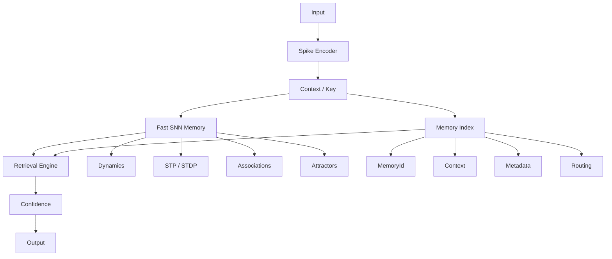

SNN отвечает прежде всего за **динамику, ассоциации и восстановление**, а Memory Manager — за **адресацию, жизненный цикл и точное удаление**.

---

# 3. Три уровня памяти

## 3.1. Working Memory

Самый быстрый уровень.

Хранит:

- текущий контекст;
- активные спайковые состояния;
- кратковременные ассоциации;
- временные следы синапсов.

Время жизни: от миллисекунд до минут/часов в зависимости от модели.

Главное свойство:

**очень быстро записывается и очень легко сбрасывается.**

---

## 3.2. Episodic / Fast Memory

Основной уровень для MVP.

Каждое воспоминание имеет отдельный логический идентификатор:

```text
MemoryId
Pattern
ContextId
Timestamp
Strength
SynapseSet
Status
TTL
```

Например:

```text
Memory #1842

Input:
    "red apple"

Pattern:
    sparse spike pattern

Context:
    kitchen

Associations:
    red
    fruit
    apple
    round
```

Эта память предназначена для событий и фактов, которые необходимо быстро записывать и забывать.

---

## 3.3. Long-Term Memory

Устойчивые знания.

Здесь допустимы:

- медленная консолидация;
- более устойчивые синаптические веса;
- общие представления;
- долговременные ассоциации.

Она не должна быть частью обычного `Reset()` быстрой памяти.


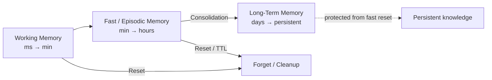

---

# 4. Представление воспоминания

Воспоминание желательно представлять не как один плотный вектор, а как **разреженный ансамбль активных нейронов + временная структура спайков + ассоциации**.

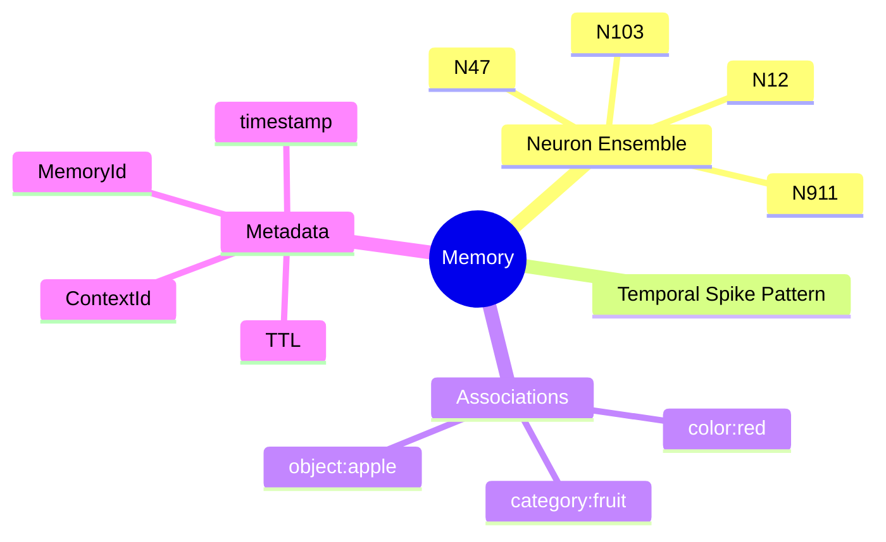

Разреженность уменьшает пересечение разных воспоминаний.

---

# 5. Запись нового воспоминания

## Pipeline

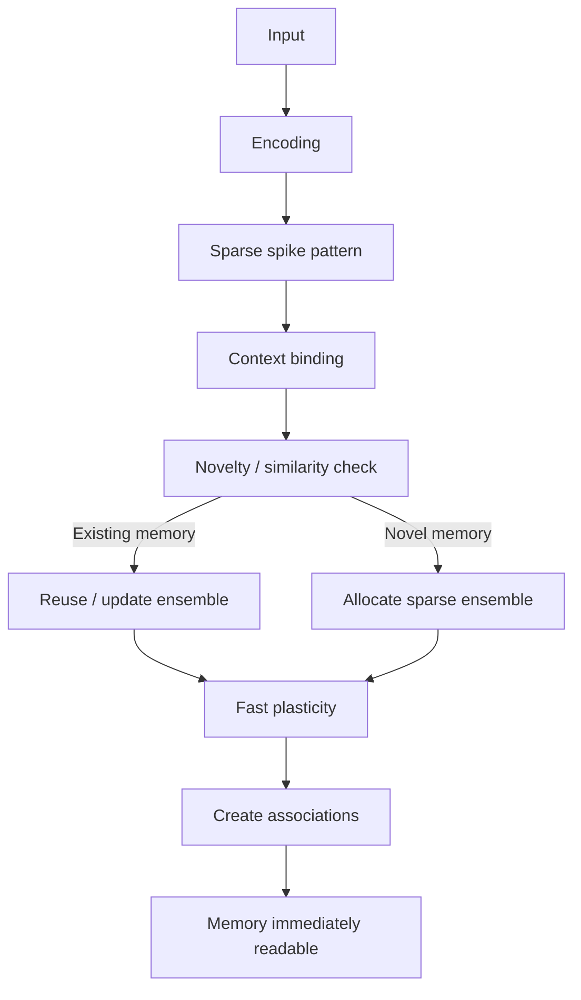

## 5.1. Encoding

Вход преобразуется в спайковое представление.

Важно сохранить не только наличие признака, но при необходимости:

- порядок;
- время;
- частоту;
- относительные задержки;
- контекст.

---

## 5.2. Novelty detection

Перед созданием новой записи система проверяет:

**Есть ли уже похожее воспоминание?**

Если да:

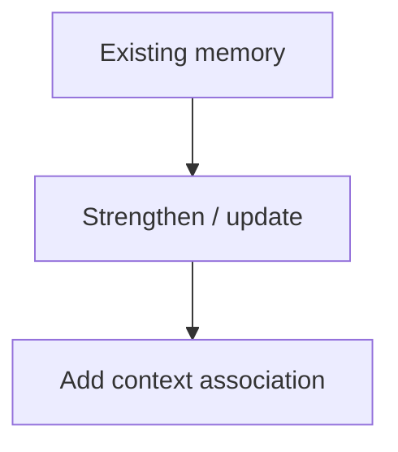

Если нет:

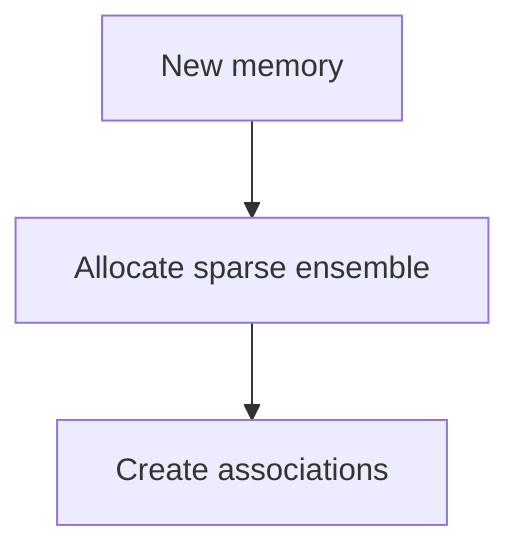

Это предотвращает создание множества почти одинаковых записей.

---

# 6. Быстрая пластичность

Для быстрого обучения используются локальные правила.

Базовый кандидат — STDP.

Упрощённо:


и:


Но одной STDP недостаточно.

Для практической памяти нужны:

- STDP;
- short-term plasticity;
- weight normalization;
- homeostatic regulation;
- competitive inhibition;
- sparsity control.

---

# 7. Два состояния синапса

Полезно разделить долговременный и быстрый компоненты:

```text
effective_weight =
    long_term_weight +
    fast_plasticity
```

Где:

### Long-term weight

Медленно меняющееся устойчивое знание.

### Fast plasticity

Временный след текущего опыта.

Это позволяет сделать:

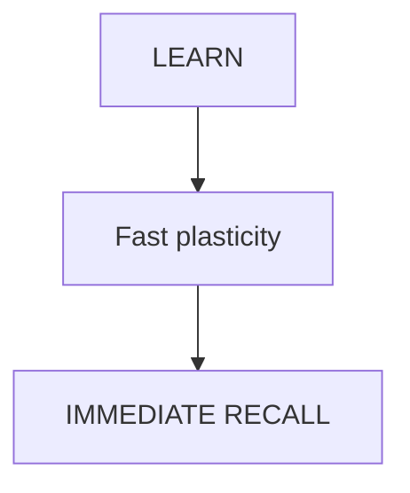

и затем:

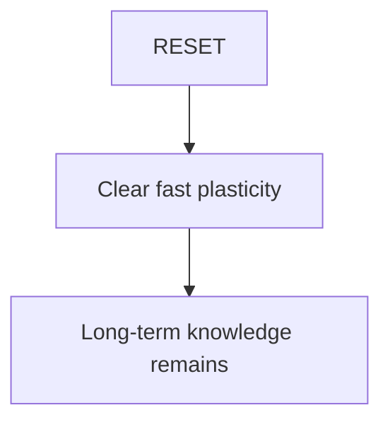

Это один из центральных механизмов всей архитектуры.

---

# 8. Ассоциативное извлечение

Память не должна требовать полного совпадения входного паттерна.

Например:

```text
stored:

[red] [round] [fruit] [apple]
```

Запрос:

```text
[red] [round] [???] [???]
```

должен активировать соответствующий ансамбль.

Рекуррентные связи переводят сеть в устойчивое состояние — **аттрактор**, соответствующий воспоминанию.

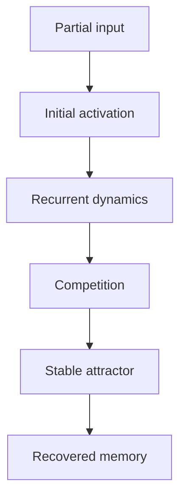

---

# 9. Конкуренция воспоминаний

При похожих входах несколько воспоминаний могут активироваться одновременно.

Поэтому нужен механизм:

**winner / sparse competition**

Например:

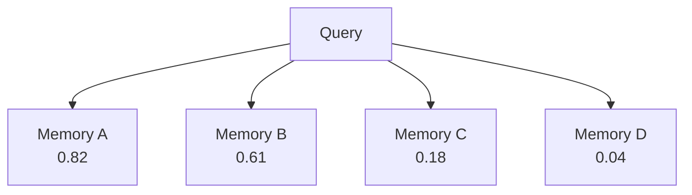

Но система не обязана всегда выбирать A.

Нужен threshold:

```text
if confidence < threshold:
    return UNKNOWN
```

Это важно.

Иначе сеть будет «вспоминать» наиболее похожий объект даже тогда, когда его на самом деле нет в памяти.

---

# 10. Индекс + SNN

Для больших объёмов памяти не следует заставлять SNN сравнивать запрос со всеми воспоминаниями.

Используется двухэтапный retrieval:

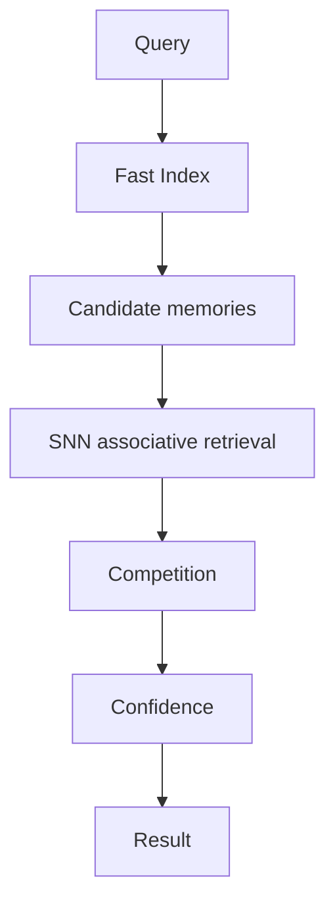

Index может быть обычной структурой данных.

Это не противоречит SNN-подходу.

SNN здесь отвечает за то, что ей действительно полезно делать:

- временную динамику;
- ассоциации;
- pattern completion;
- конкуренцию;
- устойчивые состояния.

---

# 11. Контекст

Один и тот же паттерн может иметь разные значения в разных контекстах.

Поэтому память должна иметь `ContextId`.

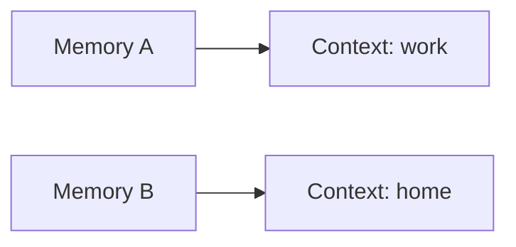

Контекст может включать:

- текущую задачу;
- источник данных;
- пользователя;
- временной эпизод;
- состояние агента;
- произвольный namespace.

Это также позволяет делать очень дешёвый сброс:

```text
ResetContext("conversation_184")
```

вместо удаления отдельных воспоминаний вручную.

---

# 12. Забывание

Должно существовать несколько операций.

## Forget(id)

Удалить конкретное воспоминание.

```text
Forget(1842)
```

## ResetContext(context)

Удалить все воспоминания контекста.

```text
ResetContext("conversation_184")
```

## ResetFastMemory()

Очистить всю быструю память.

При этом long-term memory остаётся.

## ResetAll()

Полностью очистить изменяемое состояние.

---

# 13. Логическое и физическое удаление

Удаление можно разделить на два этапа.

### Logical deletion

Сразу:

```text
Memory.status = DELETED
```

Индекс перестаёт возвращать запись.

SNN retrieval больше не рассматривает соответствующий ансамбль.

### Physical cleanup

Асинхронно:

- очищаются синаптические следы;
- освобождаются нейроны;
- удаляются временные структуры;
- очищаются caches;
- освобождаются индексы.

Это позволяет сделать `Forget()` практически мгновенным.

---

# 14. Проблема shared synapses

Самая важная техническая проблема:

**два воспоминания могут использовать один и тот же синапс.**

Поэтому нельзя просто сказать:

```text
Forget(A)
→ set all A weights to zero
```

Иначе можно повредить B.

Варианты решения:

### Вариант A — ownership

Каждая быстрая связь принадлежит одному или нескольким MemoryId.

### Вариант B — contribution

Хранить вклад отдельных воспоминаний:

```text
synapse
 ├── memory A: +0.42
 ├── memory B: +0.17
 └── memory C: -0.09
```

При удалении A пересчитывается только его вклад.

### Вариант C — sparse allocation

Выделять отдельные нейронные ансамбли для разных воспоминаний и минимизировать shared state.

Для MVP я бы начал с **C + A**, а contribution model оставил для следующей версии.

---

# 15. Consolidation

Не каждое воспоминание должно становиться долговременным.

Можно использовать:

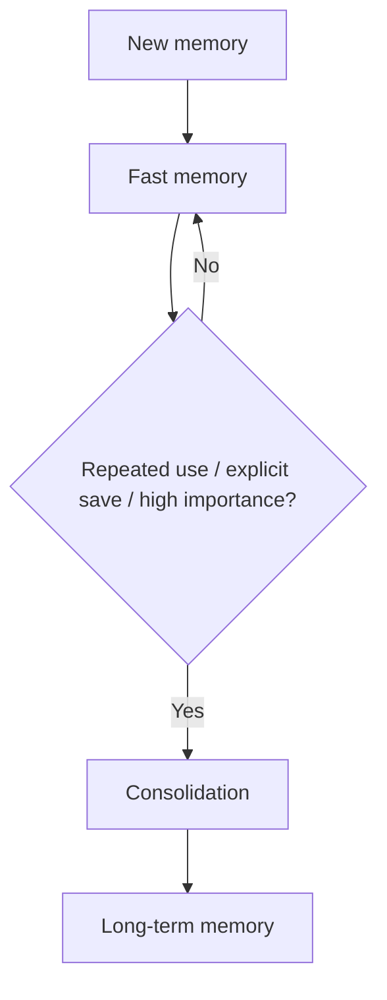

Критерии консолидации:

- частота повторения;
- количество успешных retrieval;
- явная команда `Pin`;
- importance;
- длительность существования;
- подтверждение из нескольких источников.

---

# 16. Защита от интерференции

Главная опасность онлайн-обучения:

```text
A
 ↓
B
 ↓
C
 ↓
D
 ↓
A no longer retrievable
```

Поэтому нужны:

### Sparse coding

Минимальное количество активных нейронов.

### Competitive inhibition

Ограниченное число победителей.

### Synaptic normalization

Ограничение роста весов.

### Homeostasis

Регулирование активности отдельных нейронов.

### Memory isolation

Минимизация пересечения между ансамблями.

### Consolidation

Вывод важных воспоминаний из быстрой пластичной области.

---

# 17. TTL и автоматическое забывание

Каждое воспоминание может иметь:

```text
TTL
```

Например:

```text
Memory #1842
TTL = 10 minutes
```

После истечения:

```text
ACTIVE
  ↓
EXPIRED
  ↓
LOGICALLY DELETED
  ↓
PHYSICAL CLEANUP
```

TTL особенно полезен для:

- текущего контекста;
- временных событий;
- transient state;
- conversational memory;
- сенсорной информации.

---

# 18. Memory lifecycle

Полный жизненный цикл:

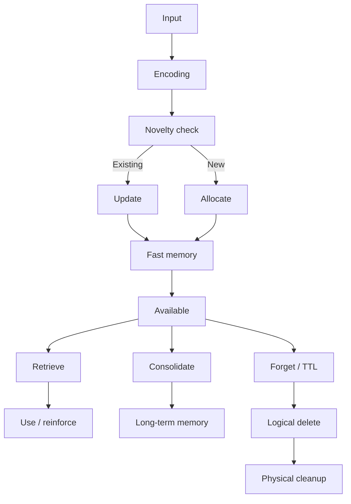

---

# 19. API концептуального уровня

Система может выглядеть примерно так:

```text
MemoryId Learn(Input, Context, Options)

Recall(Query, Context)
    → RecallResult

Forget(MemoryId)

ResetContext(ContextId)

ResetFastMemory()

ResetAll()

Pin(MemoryId)

Unpin(MemoryId)

GetMemory(MemoryId)

GetStats()
```

`RecallResult`:

```text
MemoryId
Pattern
Confidence
Similarity
Context
Timestamp
```

---

# 20. Критический тест MVP

Минимальный эксперимент должен доказать не красоту модели, а четыре свойства.

## Test 1 — One-shot

```text
Learn(A)
Recall(A)
```

Ожидается успешное восстановление.

## Test 2 — Partial recall

```text
Learn(A)
Recall(partial_A)
```

Ожидается восстановление A.

## Test 3 — Online learning

```text
Learn(A)
Learn(B)
Learn(C)
Recall(A)
Recall(B)
Recall(C)
```

Все три должны сохраняться.

## Test 4 — Selective forgetting

```text
Learn(A)
Learn(B)
Learn(C)

Forget(B)

Recall(A) → A
Recall(B) → UNKNOWN
Recall(C) → C
```

Это фундаментальный тест архитектуры.

## Test 5 — Context reset

```text
Learn(A, Context1)
Learn(B, Context1)
Learn(C, Context2)

ResetContext(Context1)

Recall(A, Context1) → UNKNOWN
Recall(B, Context1) → UNKNOWN
Recall(C, Context2) → C
```

## Test 6 — Interference

Записать большое количество похожих паттернов и измерить:

- recall accuracy;
- false recall;
- capacity;
- retrieval latency.

---

# 21. Метрики

| Метрика | Цель |
|---|---|
| Learn latency | Минимальная задержка записи |
| Recall latency | Минимальная задержка извлечения |
| One-shot recall | Работает после одного предъявления |
| Partial recall | Работает по неполному сигналу |
| Forget latency | Почти мгновенное логическое удаление |
| Forget isolation | Удаление A не повреждает B/C |
| Recall accuracy | Точность восстановления |
| False recall rate | Частота ложных воспоминаний |
| Interference | Ухудшение старых записей после новых |
| Capacity | Количество записей до деградации |
| Reset latency | Время очистки fast memory |

---

# 22. Что НЕ следует делать в первой версии

Не стоит сразу добавлять:

- сложную биологическую модель нейрона;
- сотни видов пластичности;
- глубокую иерархию памяти;
- обучение через глобальный backpropagation;
- нейроморфное железо;
- огромную сеть;
- сложную семантическую память.

Сначала нужно доказать базовый цикл:

```text
SPIKE ENCODE
     ↓
ONE-SHOT LEARN
     ↓
IMMEDIATE RECALL
     ↓
PARTIAL RECALL
     ↓
SELECTIVE FORGET
     ↓
NO RECALL
```

---

# 23. Предлагаемый MVP

### SNN

- LIF neuron;
- recurrent connections;
- sparse activation;
- lateral inhibition.

### Plasticity

- STDP;
- short-term plasticity;
- weight clipping;
- normalization.

### Memory

- sparse neural ensembles;
- MemoryId;
- ContextId;
- fast memory;
- optional TTL.

### Retrieval

- partial pattern matching;
- attractor dynamics;
- confidence threshold.

### Management

- Memory Index;
- logical deletion;
- asynchronous cleanup;
- context reset.

### API

```text
Learn()
Recall()
Forget()
ResetContext()
ResetFastMemory()
ResetAll()
Pin()
```

---

# 24. Ключевая гипотеза проекта

Основная гипотеза:

> **Быстрая SNN-память должна хранить не столько сами данные, сколько динамически формируемые ассоциации между разреженными нейронными ансамблями.**

При этом:

- SNN обеспечивает ассоциативную динамику;
- fast plasticity обеспечивает обучение на лету;
- sparse ensembles уменьшают интерференцию;
- Memory Manager обеспечивает адресность;
- ContextId обеспечивает изоляцию;
- TTL обеспечивает автоматическое забывание;
- logical deletion обеспечивает мгновенный reset;
- consolidation переносит важные знания в долгосрочную память.

Таким образом, получается не просто «нейросеть, которая обучается», а **управляемая нейронная память с явным жизненным циклом воспоминания**.

---

# 25. Следующий этап исследования

После MVP имеет смысл исследовать три направления:

1. **Capacity** — сколько воспоминаний реально может удерживать один ансамбль при заданной sparsity.
2. **Interference** — насколько похожие паттерны начинают смешиваться.
3. **Memory allocation** — когда создавать новый ансамбль, а когда использовать существующий.

Особенно интересен третий пункт.

В идеальной системе решение выглядит так:

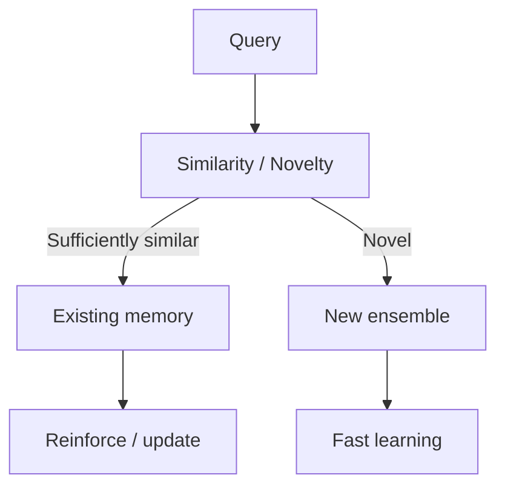

Это может стать центральным механизмом самоорганизующейся SNN-памяти.
