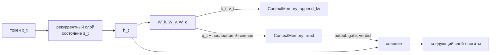

# Стыковка с рекуррентной LLM

Цель: дать модели с рекуррентным состоянием фиксированного размера (Mamba/RWKV/xLSTM-подобной) **точный доступ к контексту длиной 300k+ токенов** без O(n) внимания на каждый токен. Стек: Rust, модель на candle или burn, память — этот крейт.

## 1. Что меняется в модели



Рекуррентное состояние отвечает за «суть» и недавнее. Память отвечает за **точные** дальние участки: копирование, ассоциативное извлечение «ключ → значение», цитаты, имена, числа. Внимание остаётся, но работает только по 9 чанкам × 27 токенов = 243 позиции, которые выбрала SNN, а не по 300k.

## 2. Поток данных на токен

```rust
// Один раз на сессию.
let cfg = ContextConfig {
    kv: Some(KvConfig { precision: KvPrecision::F16, ..KvConfig::new(d_k, d_v) }),
    ..Default::default()                      // окно 300k, чанки 27 / шаг 9
};
let mut memory = ContextMemory::new(cfg)?;

// На каждом шаге генерации (или пачкой при чтении промпта).
let h = model.recurrent_step(token, &mut state);        // [d_model]
let (k, v, q) = (w_k.apply(&h), w_v.apply(&h), w_q.apply(&h));
memory.append_kv(&[token], &k, &v)?;                    // запись: O(1) на токен, чанк индексируется каждые 9

let recent = last_tokens(9);                            // лексический зонд, «induction head»
let out = memory.read(Probe::Both(&recent, &q), &q, 9)?; // SNN выбирает чанки, внимание читает их
let h = h + w_o.apply(&(out.attended.output * out.gate)) + trit_embedding[out.verdict];
```

- **Запись.** Ключи и значения текущего токена дописываются в окно. Каждые `stride = 9` токенов новый чанк на 27 токенов пишется одним предъявлением в лексическую SNN-память (детекторы n-грамм) и, если включено, в семантическую (FlyHash от среднего ключа чанка).
- **Зонд.**
  - `Probe::Tokens` — последние токены. Это точное ассоциативное извлечение: где раньше встречался этот фрагмент и что шло дальше.
  - `Probe::Key` — вектор запроса. Семантический поиск по смыслу.
  - `Probe::Both` — объединение.
- **Чтение.** Выполняется `softmax(q·k/√d)·v` по токенам найденных чанков. Точное внимание, но по ~243 позициям.
- **Тернарный гейт.** Вердикт памяти подаётся в модель как признак:

| Вердикт | Гейт | Что это значит для модели |
|---|---|---|
| `Known` (+1) | уверенность совпадения | «помню точно» — использовать |
| `Unknown` (0) | треть уверенности | «что-то похожее было» — осторожно |
| `Absent` (−1) | 0 | «этого в контексте точно нет» — не выдумывать |

  Обучаемые эмбеддинги трёх состояний (`trit_embedding`) позволяют модели выучить поведение «не знаю / точно нет» и не галлюцинировать ссылки на несуществующий контекст.

### Точные операции без внимания

- `continuation(prefix, n)` — что шло после `prefix` в последний раз. Можно использовать для копирования и спекулятивного декодирования (предложить n токенов, модель подтверждает).
- `locate(fragment)` — все точные позиции фрагмента.
- `contains(fragment)` — `Known / Unknown / Absent`. `Absent` доказан переписью n-грамм окна.

## 3. Бюджет (300k токенов, 4 vCPU)

| Операция | p50 | p99 |
|---|---:|---:|
| `read` (зонд + внимание по 9 чанкам, d=81) | 110 мкс | 250 мкс |
| `continuation` | 28 мкс | 81 мкс |
| `locate` (9 токенов) | 94 мкс | 218 мкс |
| `contains` → «точно нет» | 17 мкс | 62 мкс |
| семантическое извлечение, плотные ключи (300k записей) | 460 мкс | 600 мкс |
| запись | ~1 мкс/токен | — |

Память на 300k токенов:

| Компонент | Размер |
|---|---:|
| Лексический индекс | 36 МБ |
| Семантический индекс | 40 МБ |
| Токены | 1.5 МБ |
| K/V f16 (d_k = d_v = 81) | ~100–170 МБ |
| K/V тернарные | 22 МБ |

K/V растёт линейно с `d_k + d_v`. Для больших d стоит брать `KvPrecision::Ternary` или хранить K/V в KV-кэше модели и передавать в память только позиции (`retrieve` возвращает спаны).

Когда читать память:
- на каждом токене, если задержка допустима;
- на каждой границе чанка;
- по обучаемому гейту «нужна память», дешёвому, потому что `contains` стоит ~20 мкс.

## 4. Обучение

Память не требует backprop для записи (§6 концепции): запись идёт одним предъявлением, локальными правилами. Градиенты идут там, где они нужны:

1. **Выбор чанков** (SNN-индекс) — это stop-gradient top-k, как в Memorizing Transformers и kNN-attention.
2. **Чтение** — обычное softmax-внимание по найденным K/V. Градиенты текут в `W_q`, `W_k`, `W_v`, `W_o` и в модель.
3. **Гейт и эмбеддинги вердикта** обучаются вместе с моделью.

Рекомендации:
- Обучать с памятью в цикле на длинных последовательностях. Задачи-«учебники» для точного извлечения:
  - MQAR (multi-query associative recall);
  - needle-in-a-haystack и passkey retrieval;
  - копирование;
  - цитирование.
- Если семантический индекс должен находить нужный чанк по `q`, добавьте вспомогательную контрастную потерю: `q_t` ближе к среднему ключу целевого чанка, чем к случайным. FlyHash сохраняет косинусное сходство, поэтому хороший `q` означает хороший спайковый код.
- Ключи, записанные в начале длинной последовательности, считаются текущими весами. Устаревание внутри шага обучения допустимо (так же, как в Memorizing Transformers).
- Тернарные K/V совместимы с обучением через straight-through estimator.

## 5. Между сессиями

```rust
memory.pin(start, end)?;                    // закрепить важное: системный промпт, факты о пользователе
let bytes = memory.save_pinned();           // только закреплённые чанки, ids трайтами, триты по 40/u64
// ... новая сессия ...
let mut memory = ContextMemory::restore(cfg, &bytes)?;  // позиции продолжаются после сохранённых
```

Закреплённые чанки переживают вытеснение из окна и `reset()`. Их токены хранятся в самих энграммах. Для ядра памяти есть `SnnMemory::save(SnapshotScope::{All, LongTerm})` и `restore`/`load` с проверкой отпечатка энкодера и контрольной суммы.

## 6. Несколько последовательностей и потоков

- Одна `ContextMemory` на последовательность (батч = вектор памятей). Структуры независимы, их можно обслуживать параллельно (rayon).
- Для общей памяти между потоками есть `SharedMemory` (мьютекс + фоновая физическая очистка).

## 7. Следующие шаги

1. **Прототип на candle.** Маленькая рекуррентная LM (порядка 10–100M параметров) с этой памятью на MQAR и passkey. Проверить, что точность извлечения на 300k не падает, а качество на обычных задачах не страдает. Для 8B-модели нужен GPU-кластер. В CPU-контейнере разработки такое обучение невозможно.
2. **Память на нескольких слоях** и обучаемый гейт «нужна память».
3. **Внимание на GPU** по найденным позициям; SNN-индекс остаётся на CPU.
4. **Обобщение в долговременной памяти** (слияние похожих энграмм, §25 концепции).
